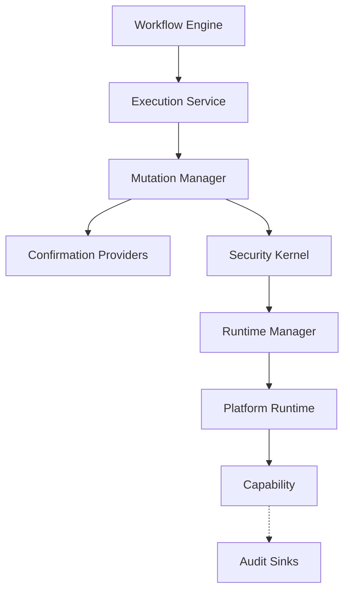

# Mutation Lifecycle Framework

The Mutation Lifecycle Framework (`core/mutation`) is a first-class kernel subsystem introduced in Milestone 16.1. It provides a standardized, platform-agnostic architecture for coordinating all destructive or state-changing capabilities (mutations) in IRA OS.

## Architecture

*(Note: The diagram represents logical flow. In implementation, the `MutationManager` orchestrates the execution service.)*

## Lifecycle

Every mutation follows a deterministic lifecycle:
1. **REQUESTED**: The mutation is requested. Capability metadata is inspected.
2. **WAITING_CONFIRMATION**: If the capability demands confirmation, execution halts until a `ConfirmationProvider` secures user/owner consent.
3. **CONFIRMED**: Consent received.
4. **EXECUTING**: Dispatched to `ExecutionService`.
5. **COMPLETED / FAILED**: Execution finishes.
6. **ROLLING_BACK / ROLLED_BACK**: If execution fails and the capability implements `MutatingCapability.rollback()`, the manager attempts to revert the state.
7. **REJECTED**: If confirmation is denied or policies reject the mutation.

In all cases (except during catastrophic kernel failure), an **Audit Record** is dispatched to all registered `AuditSinks`.

## Contracts

- `MutationManager`: The orchestrator. Never executes Android/Windows logic directly.
- `ConfirmationProvider`: Pluggable implementations (UI, CLI, Voice) that secure consent.
- `AuditSink`: Pluggable storage (SQLite, Cloud, Vault) for immutable audit records.
- `MutatingCapability`: Extension of the standard `Capability` that adds `supports_rollback` and `rollback`.
