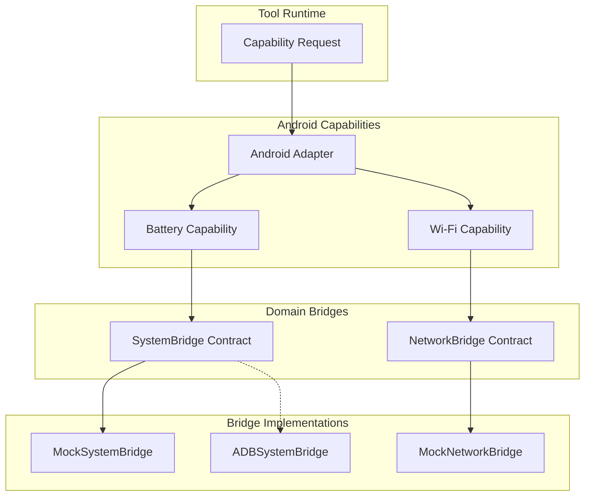

# Android Runtime Subsystem

The Android Runtime is a core component of IRA OS, responsible for bridging the generic Tool Runtime with Android-specific capabilities.

## Architecture

The architecture enforces a strict boundary between capability definition and platform execution through domain-specific **Bridges**. 

### The Bridge Pattern
Following the Interface Segregation Principle (ISP), capabilities never communicate with Android APIs directly, nor do they rely on a monolithic god-interface. 
Instead, they interact with targeted, domain-specific bridge contracts.

### Key Principles
1. **No Android SDK Dependencies:** Capabilities must never import `android.*`, `adb`, `pyjnius`, or similar APIs.
2. **Universal Execution Interface:** Capabilities invoke bridges using a universal interface: `bridge.execute(action, arguments)`. This guarantees that capabilities will require **zero changes** whether the bridge is implemented via local Python mocks, ADB, Shizuku, or Binder IPC.
3. **Strict Dependency Injection:** Capabilities declare their required bridge contract, and the DI container provides the appropriate runtime implementation.

## Security & Metadata
Every Android capability must provide a `CapabilityDescriptor` defining:
- `security_level`: (LOW, NORMAL, HIGH, CRITICAL, SYSTEM)
- `required_permissions`: Android manifest permissions required for execution.
- `requires_confirmation`: UI intervention requirement.

## Error Normalization
To prevent platform crashes from destabilizing the kernel, capabilities must wrap raw platform exceptions (e.g., JNI crashes, ADB timeouts) into `PlatformExecutionError`. Expected failures (e.g., missing permissions) are mapped to `PermissionDeniedError` and standard `CapabilityError` subclasses.
